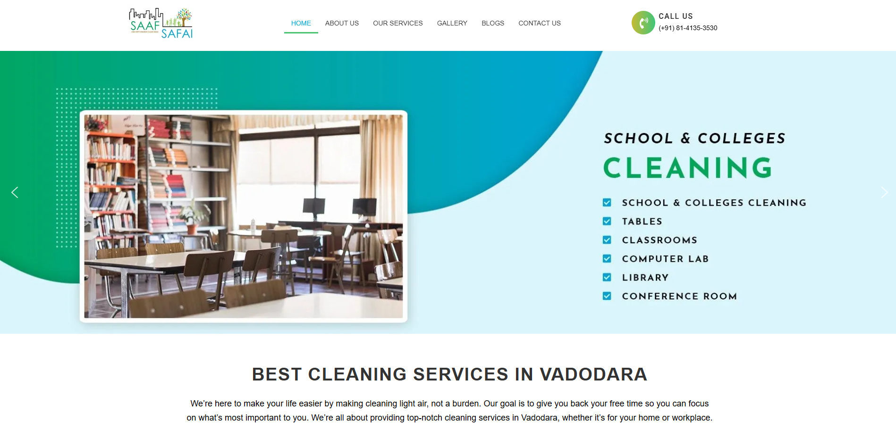

# Saaf-Safai

- **Client:** Saaf Safai Cleaning Services, Vadodara
- **Website:** [saafsafai.smartscriptstech.com](https://saafsafai.smartscriptstech.com)

### 🏢 About the Client

Saaf Safai Cleaning Services is a top residential and commercial cleaning services provider in Vadodara. Their goal is to make businesses and homes make a lasting impression with impeccable cleanliness. Saaf Safai focuses on quality and professionalism to build a strong reputation in their local market.

### 📚  Overview

Saaf Safai came to us with the requirement for a clean, contemporary, and functional business website that would:

- Mirror the brand's commitment to quality and cleanliness.
- Enhance online visibility.
- Enable easy exploration of services and inquiry.
- Be simple to manage and expandable for future additions.

### 🚧 Challenges

The biggest challenge for this project was design. The client needed a website that should be clean, good-looking, and easy to use—yet informative and conversion-oriented. Getting the perfect balance between simplicity and functionality without compromising on the brand's image was important.

### 💡Our Approach

We followed a clean and responsive design ethos that perfectly resonates with the values of the brand. This is how we did the project:

### 🧑🏻‍💻 Technology Stack

- **Frontend & Backend:** PHP, WordPress
- **Database:** MySQL
- **Plugins & Tools:** WooCommerce (for scalability in the future), Elementor (for simplicity of customization), Astra Theme (performance-oriented and lightweight)

### 🎨Design Elements

- **Minimalistic Layout:** Adopted a white-dominated color scheme to signify cleanliness and professionalism.
- **User Experience (UX):** Simplified navigation and purposefully positioned call-to-actions for inquiry of services.
- **Mobile-Responsive:** Ensured seamless interaction on every device.
- **Service Highlight Sections:** Designed separate blocks to highlight primary services using icons and concise descriptions.

### 📟Functionality

- Contact Form Integration for simplified lead collection.
- Service Pages to further describe offerings for residential and commercial customers.
- WooCommerce Setup (Optional) for future service bookings or package sales.
- SEO Basics set up for improved local search visibility.

### 📈 Results  

- **Enhanced Brand Perception:** The professional look enforces the brand's dedication to high standards.
- **Increased Engagement:** Visitors are now lingering longer and investigating services more intensely.
- **Future-Ready:** With Elementor and WooCommerce, the site is scalable for marketing and e-commerce functionality.

### 🙎🏻Client Feedback

> "We're really pleased with the result. The design is just what we wanted—clean, professional, and simple to manage. It really captures the spirit of our business."
> 
> — Team Saaf Safai
